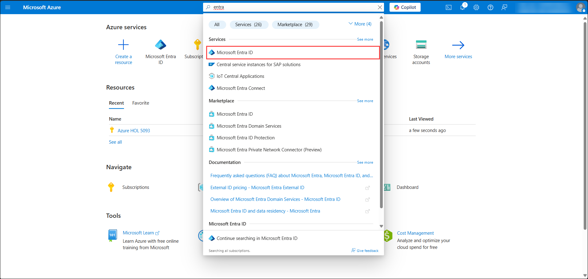
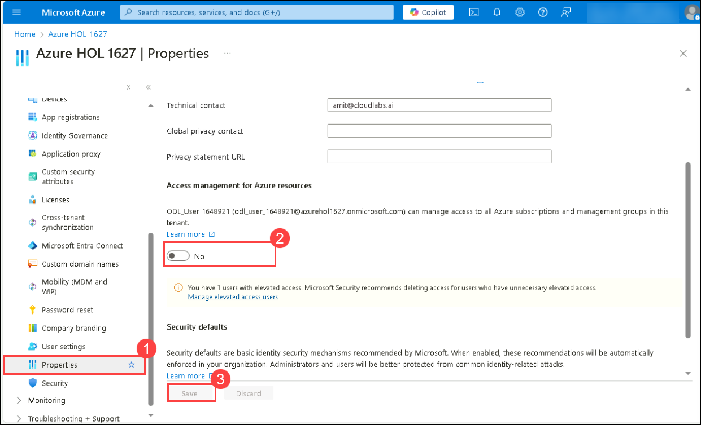
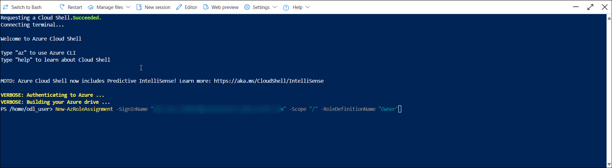
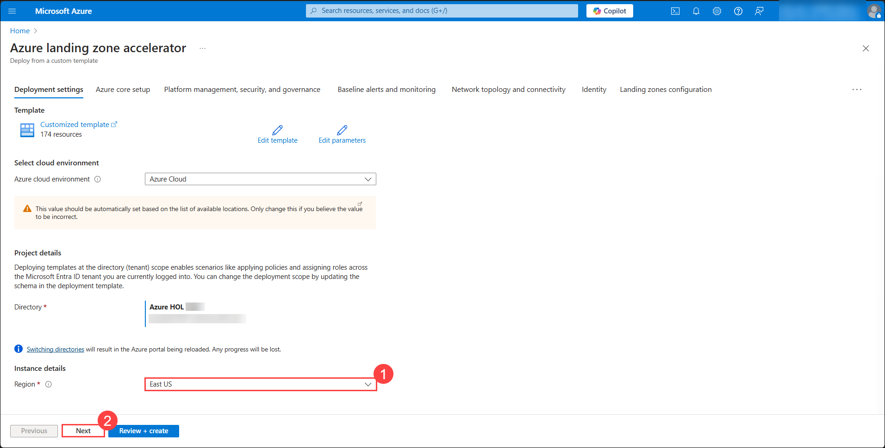
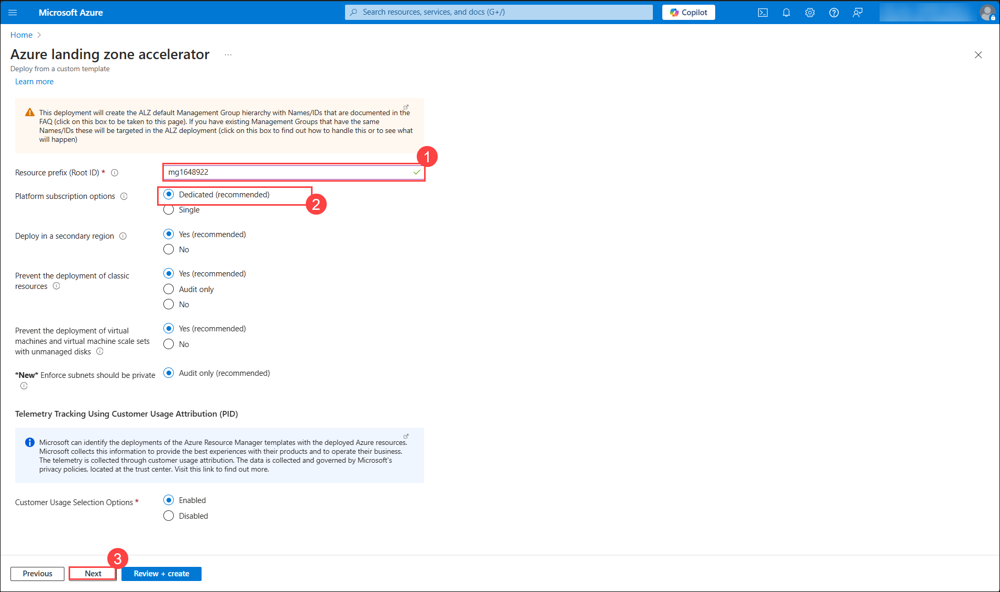
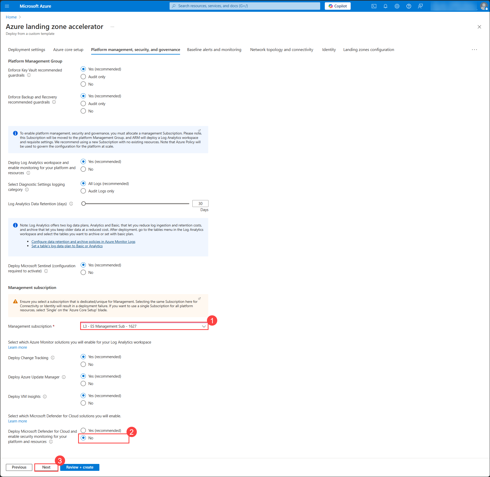
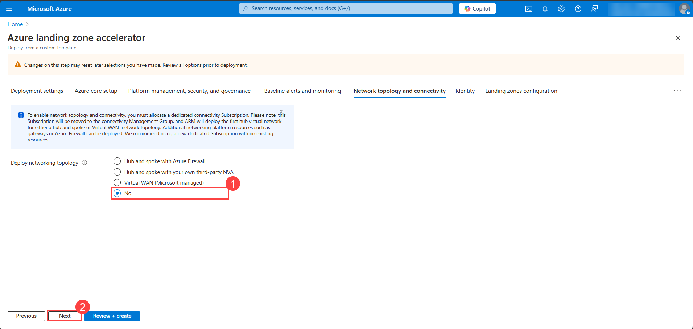
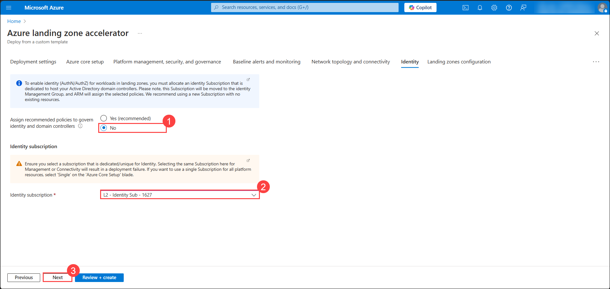
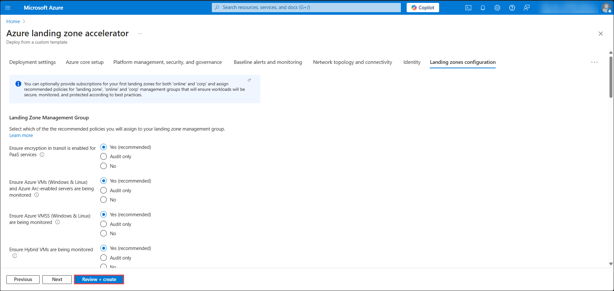

# Azure Landing Zones

## Exercise 1: Introduction to Azure Landing Zone and Deployment Options

In this exercise, you will explore the **Azure Landing Zone (ALZ) framework**, its governance components (Management Groups, Policies, and Subscriptions), and the benefits of automation. You will then deploy ALZ using either **ARM or Bicep templates**, setting up prerequisites and executing the deployment via the **Azure Portal** or **CLI**.

### Objectives
In this exercise, you will complete the following tasks:
   - Task 1: Understanding Azure Landing Zone (ALZ) Concepts 
   - Task 2: Deploying Azure Landing Zone

### Task 1: Understanding Azure Landing Zone (ALZ) Concepts 
An Azure Landing Zone (ALZ) is a structured environment in Azure that follows best practices to support application migration, modernization, and scalability. It organizes resources into Application Landing Zones (for hosting workloads) and Platform Landing Zones (for shared services like security, networking, and monitoring). The Enterprise-Scale ALZ, based on the Microsoft Cloud Adoption Framework (CAF), provides strong governance, security, and scalability.

An Azure landing zone consists of platform landing zones and application landing zones:
- **Platform Landing Zone**: A subscription that provides shared services like identity, connectivity, and management for all applications. These are managed by central IT teams. Examples include Identity, Management, and Connectivity subscriptions.
- **Application Landing Zone**: A subscription dedicated to hosting specific applications. These are pre-configured with policies and controls through management groups. Examples include `Landing Zone A1` and `Landing Zone A2` subscriptions which are the two applications.

Platform Landing Zones contain shared infrastructure services, while Application Landing Zones host the actual business applications.

**Key Features:**
1. Modular & Scalable → Supports multiple teams and workloads.

2. Secure by Design → Implements RBAC, Azure Policies, and Network Security.

3. Management Groups → Organizes subscriptions for better governance.

4. Compliance & Automation → Enforces policies and governance frameworks.

**Architecture Overview:**
1. Management Groups & Subscriptions: Organizes workloads into categories:
 - Identity → Azure AD, PIM.
 - Connectivity → Networking, Firewalls.
 - Landing Zones → Workloads & Applications.

2. Networking (Hub-Spoke Model)

 - Hub → Centralized security & networking (Firewall, ExpressRoute).
 - Spokes → Isolated environments for applications and workloads.

3. Security & Governance

 - Azure Policies → Enforce compliance (e.g., restrict VM sizes, ensure encryption, enable Defender for Cloud).
 - Defender for Cloud → Monitors security risks and threats.

**Role of Management Groups, Policies, and Subscriptions:**

1. Management Groups
 - Organize subscriptions hierarchically for better governance.
 - Inherit policies and RBAC roles.

2. Azure Policies
 - Enforce security, compliance, and governance.
 - Examples:

    i. Restricting VM locations.

    ii. Enforcing tagging for cost management.

    iii. Enabling Defender for Cloud.

3. Subscriptions
 - Used for billing, security, and workload separation.
 - Best practices include separate subscriptions for:
 - Landing Zones (Workloads).
 - Connectivity (Networking, ExpressRoute).
 - Identity & Management.

**Governance and Automation Benefits:**
1. Governance Benefits
 - Centralized security and compliance.
 - Enforces standardized architecture.
 - Supports cost management and monitoring.

2. Automation Benefits
 - Enables scalable and repeatable deployments.
 - Reduces manual errors using Infrastructure as Code (IaC).
 - Supports CI/CD for infrastructure to enhance efficiency.

### Task 2: Deploying Azure Landing Zone.
In this task, we will deploy a Platform Landing Zone using **ARM** or **Bicep** with the below architecture.

**ARM templates** are verbose JSON files that offer full Azure support but can be complex to manage, whereas **Bicep** is a more concise, modular, and human-readable DSL that simplifies infrastructure deployment while still compiling down to ARM.

   

1. Search and Navigate to **Entra ID**.

    

1. Click on **Properties**, under **Access management for Azure resources** and turn on the **toggle**.This allows elevated access to the user.

    

1. Now navigate to **CloudShell** and click on **Powershell** to go to the powershell mode and run the below commad to give the user with owner access at the tenant level.

   ```powershell
   New-AzRoleAssignment -SignInName "[userId]" -Scope "/" -RoleDefinitionName "Owner"
   ```
   **Note:** Replace **[userId]** with **<inject key="AzureAdUserEmail"></inject>**.

    

1. Now, we will deploy the Azure Landing Zone using either ARM templates or Bicep. You can choose whichever approach you prefer.

 - **ARM template**: Copy the below hyperlink to deploy the resources for azure landing zone

    [](https://aka.ms/caf/ready/accelerator)

4. On the **Custom deployment** blade, in the **Basics** section, choose the Region as `EastUS` (1) and click on **Next: Azure core setup** (2).

    

1. On the **Azure core setup** section, provide the below inputs and click on **Next** (3)

   - Management Group prefix: **mg<inject key="DeploymentID" enableCopy="false"></inject>** (1)
   - Select dedicated subscriptions or single subscription for platform resources: make sure **Dedicated** is selected (2)

    

1. On the **Platform management, security, and governance** section, select the management subscription **L3- ES Management Sub - Suffix** (1) and select **No**(2) option for **Deploy Azure Security Center and enable security monitoring for your platform and resources** and click on **Next**.

    

1. In the **Baseline alerts and Monitoring** section leave everything as default and click on **Next**.

1. In **Network Topology and connectivity**, make sure that **No** (1) is selected for **Deploy networking topology** and click on **Next** (2).

    

1. Under **Identity** select **No**(1) for **Assign recommended policies to govern identity and domain controllers** and select **L2 - Identity Syb - Sub - Suffix**(2) for Identity subscription and click on **Next** (3).

    

1. In **landing zone** configuration page leave everything as default and click on **Review + Create**.

    

1. After the template has passed the validation, click **Create**. This will deploy the initial Management Group structure together with the required Policy/PolicySet definitions. It will also move the subscription under the right Management Group and will also deploy a Log Analytics Workspace and enable platform monitoring. This process will take around **10-15 minutes** to complete.

## Review
In this exercise you have completed the following

   - Learnt about Azure Landing Zone (ALZ) Concepts
   - Deployed Azure Landing Zone.
