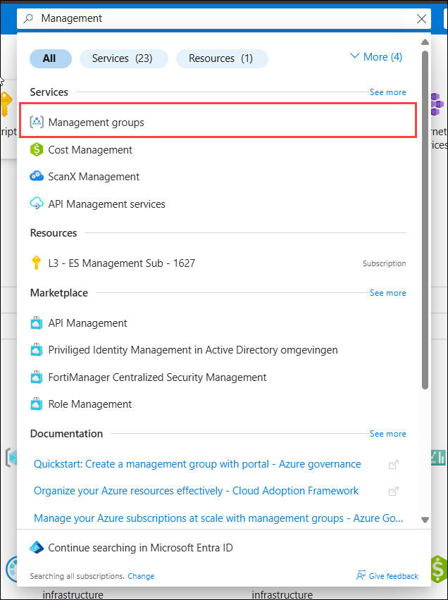
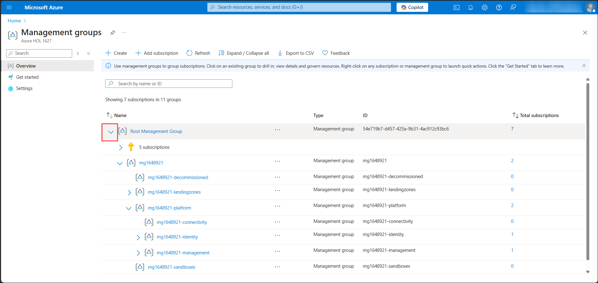
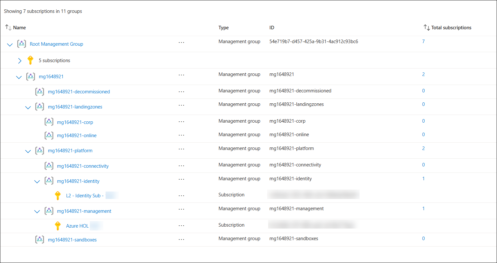
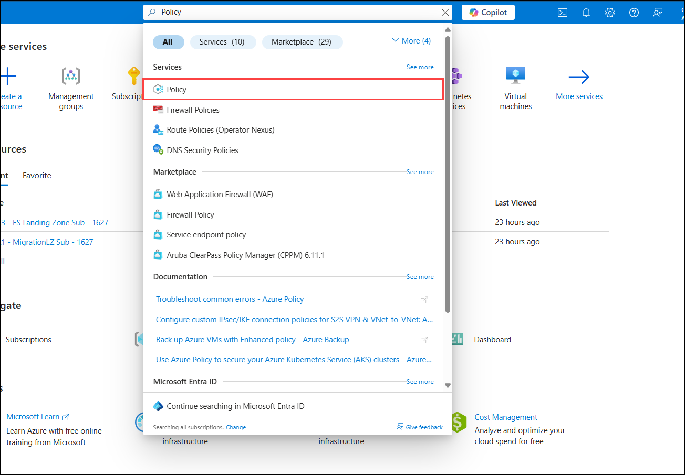
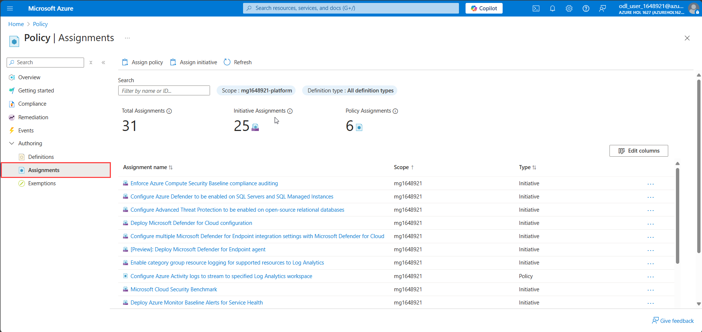
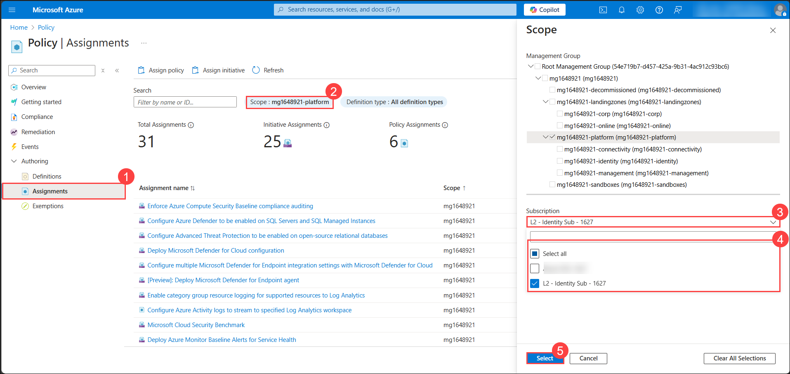
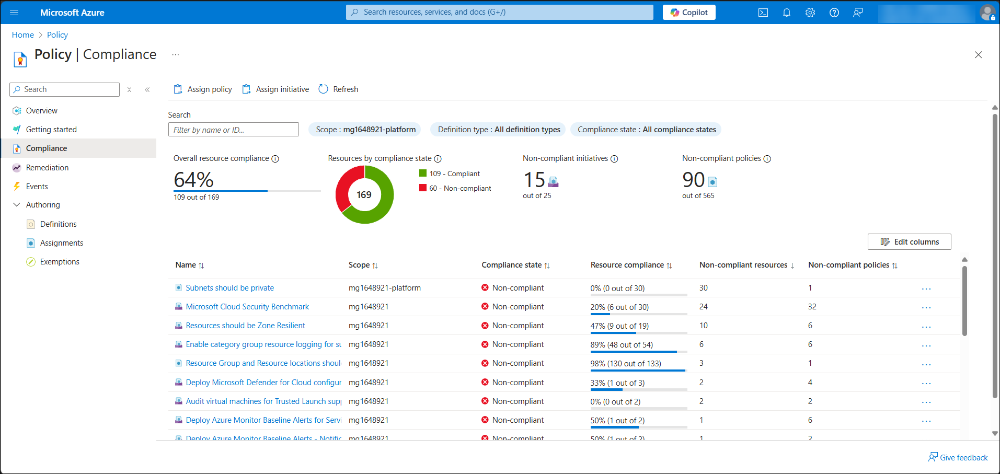
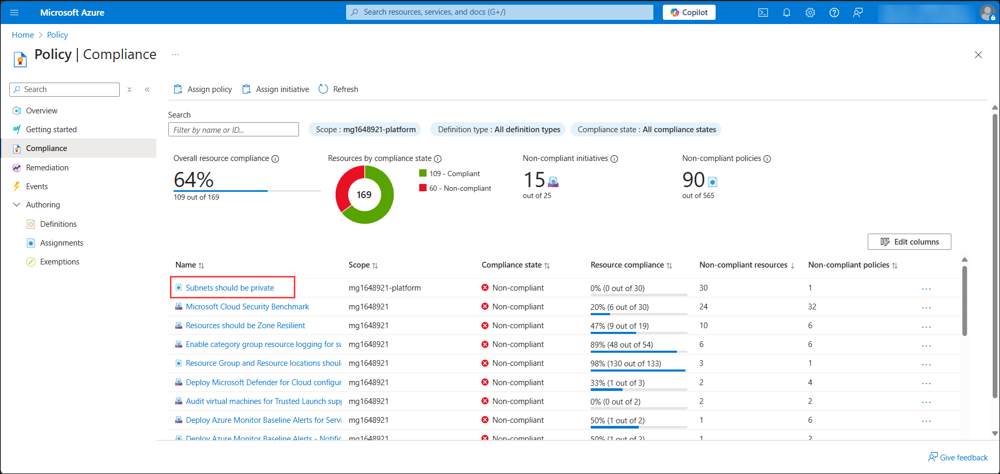

## Exercise 2: Reviewing the Deployed ALZ Foundation

In this exercise, you will explore the **Management Group (MG) hierarchy and subscriptions**, followed by validating **Azure policies and security controls** to ensure governance and compliance.

### Objectives
In this exercise, you will complete the following tasks:
   - Task 1: Exploring the Management Group (MG) Hierarchy and Subscriptions
   - Task 2: Validating Azure Policies and Security Controls

### Task 1: Exploring the Management Group (MG) Hierarchy and Subscriptions

1. In the [Azure Portal](https://portal.azure.com), search for **Management Groups** in the search bar and select it.  

    

1. Expand the **mg<inject key="DeploymentID" enableCopy="false"></inject>** under the Root Management Group to verify the management groups like **mg<inject key="DeploymentID" enableCopy="false"></inject>-decommissioned**, **mg<inject key="DeploymentID" enableCopy="false"></inject>-landingzones**, 
**mg<inject key="DeploymentID" enableCopy="false"></inject>-platform**, and **mg<inject key="DeploymentID" enableCopy="false"></inject>-sandboxes**.

1. Each of these management groups have different functions which are listed below
    - **Tenant Root Group** – The top-level management group that contains all subscriptions in the tenant.
    - **mg<inject key="DeploymentID" enableCopy="false"></inject>** – A parent management group organizing all child groups under the tenant.
    - **mg<inject key="DeploymentID" enableCopy="false"></inject>-decommissioned** – Holds resources or subscriptions that are no longer in active use.
    - **mg<inject key="DeploymentID" enableCopy="false"></inject>-landingzones** – Manages enterprise workloads and landing zones for production and development.
    - **mg<inject key="DeploymentID" enableCopy="false"></inject>-platform** – Contains shared services like identity, networking, and management resources.
    - **mg<inject key="DeploymentID" enableCopy="false"></inject>-sandboxes** – Isolates non-production environments for testing and experimentation.

    

1. Click on each **Management Group** and check **Subscriptions** assigned under them.

    

1. We can also see that few Subscriptions are not assigned to any management groups, which we are going to in further exercises for different purposes.

### Task 2: Validating Azure Policies and Security Controls

1. In the **Azure Portal**, search for **Policy** in the search bar. 

     

1. Click on **Policy** under **Authoring**.  

1. In the **Policy | Assignments** tab:  
   - Review policy assignments applied to subscriptions and management groups.  
   - Check the **Scope**, where the policy is enforced.  

     

1. Check how policies are enforced across multiple subscriptions:  
   - In **Policy → Assignments**, filter by subscription.  
   - Identify any missing policy assignments at the subscription level. 

     

1. Verify if **Deny, Audit, or Enforce** policies are correctly applied to prevent non-compliance. 

1. Go to **Compliance** from the left pane. 

1. Review the **Security Benchmark compliance**.

     

1. Identify non-compliant policies and click on them to view affected resources.  

     

1. For any **non-compliant policy**, review:  
   - The reason for non-compliance.    

     

## Review
In this exercise you have completed the following:
   - Explored the Management Group (MG) Hierarchy and Subscriptions.
   - Validated Azure Policies and Security Controls.

