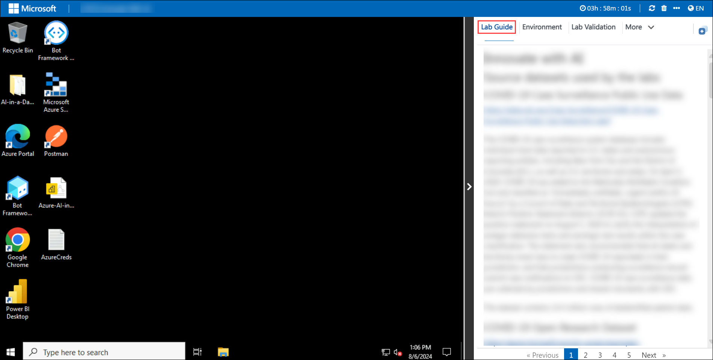
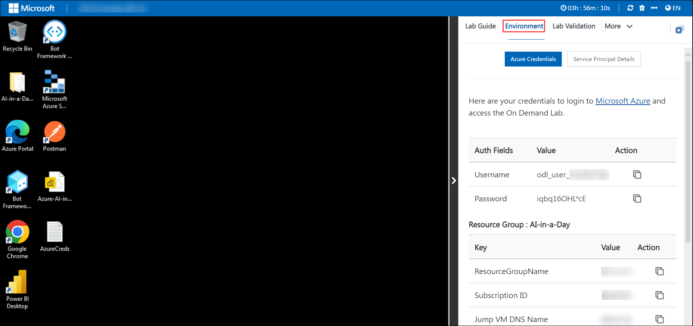
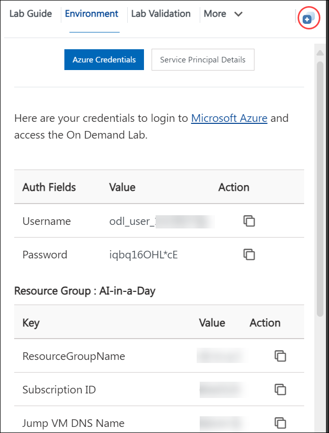
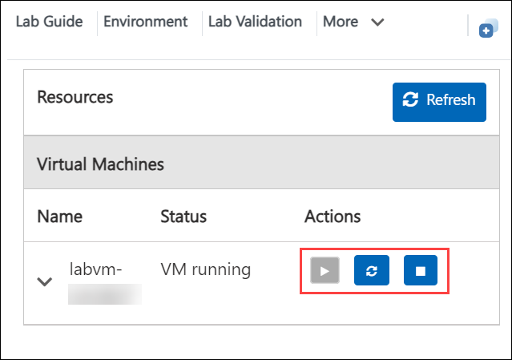

# Azure Landing Zones

### Overall Estimated Duration: 4 Hours

## Overview

In this lab, you will **deploy an Azure Landing Zone (ALZ)** with **Management Groups (MGs) and Subscriptions** to establish a well-structured cloud environment. You will utilize the **App Service ALZ Accelerator** for a **secure and scalable** App Service deployment, ensuring best practices for workload hosting. Additionally, you will implement **Azure Monitor Baseline Alerts (AMBA)** for **proactive monitoring and alerting**, helping to maintain system health. Governance and security controls will be enforced by applying **Azure Policies, role-based access control (RBAC), and compliance measures**. You will also deploy and secure an **application workload** within a new **App Landing Zone (LZ) subscription** while configuring **Azure Monitor, Log Analytics, and operational dashboards** to gain visibility into system performance and security.

## Objective

### **Objective**  

Understand how to design, deploy, and manage an **Azure Landing Zone (ALZ)** for enterprise-scale cloud adoption. By the end of the lab, you will have knowledge on:  

- **Deploying an Azure Landing Zone (ALZ) with Management Groups (MGs) and Subscriptions**  
  Learn how to structure and deploy an **Azure Landing Zone** using **Management Groups and Subscriptions** to establish governance, security, and scalability best practices.  

- **Utilizing the App Service ALZ Accelerator for Secure and Scalable App Service Deployment**  
  Explore how to leverage the **App Service ALZ Accelerator** to deploy and manage secure, scalable applications while ensuring compliance with enterprise policies.  

- **Implementing Azure Monitor Baseline Alerts (AMBA) for Proactive Monitoring and Alerting**  
  Learn to configure **Azure Monitor Baseline Alerts (AMBA)** to detect anomalies, ensure system health, and proactively respond to issues in your cloud environment.  

- **Applying Azure Policies, Role-Based Access Control (RBAC), and Governance Controls**  
  Gain expertise in enforcing security and compliance by implementing **Azure Policies, RBAC, and governance mechanisms** to standardize resource management.  

- **Deploying and Securing an Application Workload in a New App Landing Zone (LZ) Subscription**  
  Understand how to deploy, configure, and secure an **application workload** within a **new App Landing Zone (LZ) subscription** while maintaining governance and security controls.  

- **Configuring Azure Monitor, Log Analytics, and Operational Dashboards**  
  Learn how to set up **Azure Monitor, Log Analytics, and operational dashboards** to gain insights into system performance, security posture, and operational efficiency.

## Pre-requisites

Participants should have:

- Basic understanding of Azure Services and Azure DevOps.
- Working knowledge with Github.
- Familarity with Bicep.

## Getting Started with Lab
Once you're ready to dive in, your virtual machine and lab guide will be right at your fingertips within your web browser.

## Virtual Machine & Lab Guide
Your virtual machine is your workhorse throughout the workshop. The lab guide is your roadmap to success.

## Exploring Your Lab Resources
To get a better understanding of your lab resources and credentials, navigate to the **Environment Details** tab.

## Utilizing the Split Window Feature
For convenience, you can open the lab guide in a separate window by selecting the Split Window button from the top right corner.

## Managing Your Virtual Machine
Feel free to start, stop, or restart your virtual machine as needed from the Resources tab. Your experience is in your hands!

## Let's Get Started with Azure Portal
 
1. On your virtual machine, click on the **Azure Portal** icon as shown below:
 
   

1. On the **Sign in to Microsoft Azure** tab you will see the login screen, in that enter the following email/username, and click on **Next**. 

   * **Email/Username**: <inject key="AzureAdUserEmail"></inject>
   
      
     
1. Now enter the following password and click on **Sign in**.
   
   * **Password**: <inject key="AzureAdUserPassword"></inject>
   
      

1. If you see the pop-up Action Required, click Ask Later.

   

   >**NOTE:** Do not enable MFA, select **Ask Later**.
     
1. If you see the pop-up **Stay Signed in?**, select **No**.

1. If you see the pop-up **You have free Azure Advisor recommendations!**, close the window to continue the lab.

1. If a **Welcome to Microsoft Azure** popup window appears, select **Maybe Later** to skip the tour.

## Support Contact

The CloudLabs support team is available 24/7, 365 days a year, via email and live chat to ensure seamless assistance at any time. We offer dedicated support channels tailored specifically for both learners and instructors, ensuring that all your needs are promptly and efficiently addressed.

Learner Support Contacts:

- Email Support: cloudlabs-support@spektrasystems.com
- Live Chat Support: https://cloudlabs.ai/labs-support

Click **Next** from the bottom right corner to embark on your Lab journey!

### Happy Learning!!

